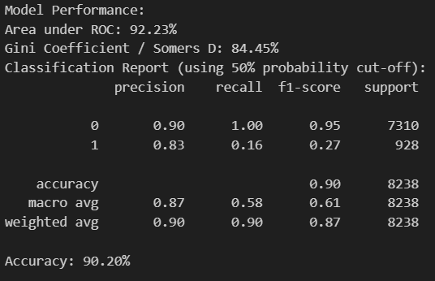

# Bank Marketing Machine Learning Analysis

This report examines a dataset from direct marketing campaigns (phone calls) run by a Portuguese bank.

The aim is to understand what drives successful telemarketing efforts and identify key factors that can improve marketing strategies. The goal is to predict which customers are most likely to sign up for term deposit products through telemarketing. With better targeting, the bank can cut marketing costs and boost return on investment (ROI).

- **Model Type:** Classification model
- **Predictive Target:** Signed up for a term deposit (1) or not (0)

## Data Source

This project uses the **UCI Machine Learning Repository: Bank Marketing Data Set (2012)**. You can access it here:  
[UCI Bank Marketing Dataset](http://archive.ics.uci.edu/ml/datasets/Bank+Marketing) _(Accessed: August 26, 2022)_.

**Original Source:**  
Moro, S., Cortez, P., & Rita, P. (2014). _A Data-Driven Approach to Predict the Success of Bank Telemarketing_. Decision Support Systems, Elsevier, 62, 22-31. doi:10.1016/j.dss.2014.06.001

---

## Training and Testing Data

- **Total Records:** 41,188 (20 attributes)
- **Training Set:** 80% (32,950 records)
- **Testing Set:** 20% (8,238 records)

**Stratified Splitting:** Ensures balanced distribution of the target variable across sets.

---

## Data Preparation and Splitting (Python)

1. Removing Duplicates

- Duplicate records are removed to prevent redundancy and ensure that no data point is overrepresented.

2. Handling Categorical Variables

- The dataset contains categorical features, which must be converted into a numeric format for the model.
- One-hot encoding is applied to categorical variables, ensuring that they are properly represented without introducing bias.

3. Target Variable Transformation

- The dependent variable (y), originally labeled as "yes" or "no", is mapped to binary values (1 and 0, respectively) to enable classification.

4. Handling Missing or Unknown Values

- Some categorical attributes contain "unknown" values, which may represent missing information. These values are replaced with NaN, and the dataset is cleaned by removing rows with missing values.
- Missing values could be imputed rather than removed, depending on the dataset size and the significance of missing data.

5. Feature Scaling

- Since AdaBoost is sensitive to feature magnitudes, StandardScaler is applied to numerical features to standardise them.
- This ensures that all numerical values have similar ranges, improving the stability of the model.

6. Train-Test Split

- The dataset is divided into training (80%) and testing (20%) subsets using stratified sampling, ensuring that the distribution of the target variable is maintained across both sets.

```python
# Import libraries
from sklearn.model_selection import train_test_split
import pandas as pd

# Load the dataset
df = pd.read_csv('bank-additional-full.csv', sep=';')

# Remove duplicates
df.drop_duplicates(inplace=True)

# Encode target ('y'): 'yes' → 1, 'no' → 0
df['y'] = df['y'].map({'yes': 1, 'no': 0}).astype(int)

# Handling missing or unknown values
df.replace("unknown", np.nan, inplace=True)
df.dropna(inplace=True)  # Drop rows with missing values (alternative: impute values)

# Split into features and target
X = df.drop(columns='y')
y = df['y']

# Train-test split with stratification
X_train, X_test, y_train, y_test = train_test_split(
    X, y, test_size=0.2, random_state=7, stratify=y
)
```

---

**Key Points:**

- **Stratification** maintains class balance.
- `random_state=7` ensures reproducibility.
- `map()` simplifies target encoding.

This setup ensures a strong foundation for modeling and evaluation.

## Evaluation Metrics

The dataset has an **11.26% positive class rate**, highlighting the importance of using multiple metrics beyond accuracy to evaluate model performance effectively.

### 1. **Accuracy**

- **Definition:** The ratio of correctly predicted outcomes to total predictions.
- **Strength:** Simple and easy to interpret.
- **Limitation:** Misleading on imbalanced datasets.

### 2. **Recall (Sensitivity)**

- **Definition:** The proportion of actual positives correctly identified.
- **Strength:** Essential for minimizing false negatives (e.g., identifying potential subscribers).
- **Limitation:** Only evaluates one performance aspect.

### 3. **Precision**

- **Definition:** The proportion of predicted positives that are truly positive.
- **Strength:** Useful for minimizing false positives, ensuring correct customer targeting.
- **Limitation:** Focuses solely on one performance dimension.

### 4. **F1 Score**

- **Definition:** The harmonic mean of precision and recall.
- **Strength:** Balances false positives and false negatives, suitable for imbalanced datasets.
- **Limitation:** Provides a single score, masking individual performance aspects.

## Model 1: AdaBoostClassifier

<b>Analysed by: Yukitoshi Imaizumi Zhou</b>

<b>Student ID: 470445952</b>

AdaBoostClassifier (Adaptive Boosting Classifier) is an ensemble learning algorithm that combines multiple weak classifiers to form a strong predictive model. It works by iteratively training weak learners, adjusting their weights to focus on misclassified instances, and combining their predictions to improve overall accuracy. Unlike traditional models that treat all samples equally, AdaBoostClassifier assigns higher importance to difficult-to-classify examples, allowing it to refine decision boundaries over multiple iterations. By leveraging weak learners such as decision stumps (single-level decision trees), AdaBoostClassifier enhances classification performance while maintaining computational efficiency.

### Justification of Model Choice

- <b>AdaBoostClassifier is effective for classification problems</b>, making it suitable for predicting whether a customer will subscribe to a financial product.
- <b>It enhances weak learners</b> by iteratively refining their predictions, reducing bias and improving overall performance.
- <b>The model can handle both linear and non-linear relationships</b>, allowing it to capture complex patterns in the dataset.
- <b>AdaBoostClassifier performs well with structured tabular data</b>, making it ideal for datasets with a mix of numerical and categorical variables (after one-hot encoding).
- <b>It does not require extensive parameter tuning</b> or strong assumptions about the data, making it a practical and interpretable choice for customer subscription prediction.

### Libraries Used

The implementation of **AdaBoostClassifier** relies on several Python libraries for **data handling, preprocessing, model training, evaluation, and visualisation**. Below is an overview of the libraries used in this study:

- **pandas**: Used for loading, cleaning, and transforming the dataset into a structured format suitable for machine learning.
- **numpy**: Provides support for numerical computations and array operations, ensuring efficient data processing.
- **seaborn**: Used for advanced data visualisation, particularly for analysing feature distributions and plotting confusion matrices.
- **matplotlib.pyplot**: Used for generating various plots, including feature importance graphs, ROC curves, and confusion matrices.
- **sklearn.model_selection**: Provides **train_test_split** for splitting the dataset into training and testing sets, and **RandomizedSearchCV** for hyperparameter tuning.
- **sklearn.preprocessing**: Includes **StandardScaler**, which is used to standardise numerical features, ensuring uniform feature scaling.
- **sklearn.ensemble**: Contains **AdaBoostClassifier**, the core model used for classification in this study.
- **sklearn.metrics**: Provides multiple evaluation metrics, including **accuracy_score, precision_score, recall_score, f1_score, roc_auc_score**, as well as functions for generating **classification reports, confusion matrices, and ROC curves**.

These libraries collectively enable the efficient development, tuning, and evaluation of the **AdaBoostClassifier** while ensuring that the model is both interpretable and well-optimised.

```python
import pandas as pd
import numpy as np
import seaborn as sns
import matplotlib.pyplot as plt
from sklearn.model_selection import train_test_split, RandomizedSearchCV
from sklearn.preprocessing import StandardScaler
from sklearn.ensemble import AdaBoostClassifier
from sklearn.metrics import accuracy_score, precision_score, recall_score, f1_score, roc_auc_score, classification_report, confusion_matrix, roc_curve, auc
```

### Data Pre-Processing

The dataset used in this study has already undergone extensive preprocessing, as outlined in the group section. This includes <b> removing duplicate records, handling missing or unknown values, encoding categorical variables through one-hot encoding </b>, and <b> splitting the dataset into training and testing sets</b> using stratified sampling to maintain class distribution. These steps ensure that the data is well-structured and suitable for classification.

For this specific implementation of <b>AdaBoostClassifier</b>, an additional preprocessing step is applied — <b>Feature Scaling</b>. Since AdaBoost is sensitive to feature magnitudes, standardisation is performed using <b>StandardScaler</b>, transforming numerical features to have <b>zero mean and unit variance</b>. This prevents attributes with larger scales from disproportionately influencing the learning process. The transformation is applied as follows:

```python
scaler = StandardScaler()
X_train = scaler.fit_transform(X_train)
X_test = scaler.transform(X_test)
```

Applying standardisation ensures that numerical attributes such as <b>age, balance, and duration</b> remain on a consistent scale, contributing to improved model stability and performance. With these preprocessing steps in place, the dataset is fully prepared for training the <b>AdaBoostClassifier</b>, enabling an effective and unbiased evaluation of its predictive capabilities.

### Baseline Model Training and Evaluation

To establish a benchmark for comparison, an initial AdaBoostClassifier model is trained using default hyperparameters, serving as a baseline for further refinement. The dataset is divided into training and test sets using stratified sampling to maintain the target variable's distribution. The model is trained with 50 estimators (default setting) and a learning rate of 1.0, ensuring that the model can effectively learn from the data while maintaining computational efficiency.

The classification report for the baseline model highlights that while precision for the majority class is high, recall for the minority class (subscribed customers) is comparatively lower, suggesting that the model struggles to capture all positive cases. The confusion matrix further illustrates this issue, as it shows a substantial number of false negatives. Despite this, the ROC-AUC score of 0.9358 suggests that the model has strong overall predictive capability, meaning it can distinguish between subscribed and non-subscribed customers well.

#### Step 1: Define Model Evaluation Function

Before training, a function is created to evaluate models by computing classification metrics, plotting a confusion matrix, and generating a ROC curve:

```python
# Model Evaluation Function
def evaluate_model(model, X_test, y_test, label):
    y_pred = model.predict(X_test)
    y_prob = model.predict_proba(X_test)[:, 1]

    print(f"\nPerformance for {label}:")
    print(f"Accuracy: {accuracy_score(y_test, y_pred):.4f}")
    print(f"Precision: {precision_score(y_test, y_pred):.4f}")
    print(f"Recall: {recall_score(y_test, y_pred):.4f}")
    print(f"F1 Score: {f1_score(y_test, y_pred):.4f}")
    print(f"ROC AUC: {roc_auc_score(y_test, y_prob):.4f}")
    print("\nClassification Report:\n", classification_report(y_test, y_pred))

    # Confusion Matrix
    cm = confusion_matrix(y_test, y_pred)
    plt.figure(figsize=(6, 4))
    sns.heatmap(cm, annot=True, fmt='d', cmap='Blues', xticklabels=['No', 'Yes'], yticklabels=['No', 'Yes'])
    plt.xlabel("Predicted")
    plt.ylabel("Actual")
    plt.title(f"Confusion Matrix - {label}")
    plt.show()

    # ROC Curve
    fpr, tpr, _ = roc_curve(y_test, y_prob)
    plt.figure(figsize=(6, 4))
    plt.plot(fpr, tpr, label=f'ROC Curve (AUC = {auc(fpr, tpr):.4f}')
    plt.plot([0, 1], [0, 1], 'k--')
    plt.xlabel("False Positive Rate")
    plt.ylabel("True Positive Rate")
    plt.title(f"ROC Curve - {label}")
    plt.legend()
    plt.show()
```

#### Step 2: Train the Baseline Model

The baseline model was implemented as follows:

```python
# Train baseline model
baseline_model = AdaBoostClassifier(n_estimators = 50, random_state=42)
baseline_model.fit(X_train, y_train)
```

#### Step 3: Evaluate the Baseline Model

After training, the baseline model was evaluated using key classification metrics, a confusion matrix, and a ROC curve:

```python
# Evaluate baseline model
evaluate_model(baseline_model, X_test, y_test, "Baseline Model")
```

<b>Baseline Model Performance</b>

The following evaluation metrics summarise the model’s performance:


<b> Confusion Matrix - Baseline Model</b>

The confusion matrix visualises the number of correct and incorrect predictions:

- <b>True Negatives (TN): 5178</b> (Correctly predicted non-subscribed customers)
- <b>False Positives (FP): 146</b> (Incorrectly predicted non-subscribers as subscribers)
- <b>False Negatives (FN): 468</b> (Incorrectly predicted subscribers as non-subscribers)
- <b>True Positives (TP): 304</b> (Correctly predicted subscribed customers)


<b>ROC Curve - Baseline Model</b>

The ROC curve demonstrates the model’s ability to distinguish between subscribed and non-subscribed customers. The <b>AUC score of 0.9358</b> indicates strong classification performance.


### Baseline Model Observation

- The <b>high precision (92%) for the majority class</b> suggests that the model correctly predicts non-subscribed customers with high accuracy.
- However, the <b>recall for subscribed customers is low (39%)</b>, indicating that the model fails to identify a significant proportion of actual subscribers.
- The <b>high ROC-AUC score (0.9358)</b> suggests that despite the recall issue, the model effectively distinguishes between the two classes.

This baseline model serves as a <b>reference point</b> for further improvements through <b>hyperparameter tuning</b>, which aims to increase recall and F1-score while maintaining strong overall classification performance.

### Hyperparameter Tuning

To improve the predictive performance of the AdaBoostClassifier, hyperparameter tuning is conducted using RandomizedSearchCV. The goal is to optimise the number of estimators and the learning rate, enhancing the model’s ability to identify subscribed customers while minimising false negatives.

#### Step 4: Perform Hyperparameter Tuning

To efficiently search for the best hyperparameters, a range of values is defined for n_estimators and learning_rate. The tuning process explores the following values:

- `n_estimators = [50, 100, 200, 300, 400, 500]`
- `learning_rate = [0.001, 0.01, 0.1, 0.5, 1.0]`

Using RandomizedSearchCV, the algorithm selects a subset of hyperparameter combinations to reduce computation time while ensuring model optimisation.

```python
# Hyperparameter Tuning with RandomizedSearchCV for efficiency
param_dist = {
    'n_estimators': [50, 100, 200, 300, 400, 500],
    'learning_rate': [0.001, 0.01, 0.1, 0.5, 1.0],
}

random_search = RandomizedSearchCV(AdaBoostClassifier(random_state=42), param_distributions=param_dist, cv=5, scoring='f1', n_jobs=-1, n_iter=10, random_state=42)
random_search.fit(X_train, y_train)
print(f"Best Parameters: {random_search.best_params_}")
```

After running the tuning process, the <b>best combination of hyperparameters is selected</b> and stored in `random_search.best_params_`, which will be used to train the final model.

### Final Model Training and Evaluation

After optimising the AdaBoostClassifier, the final model is trained using the best hyperparameters identified through RandomizedSearchCV. This refined model is expected to improve recall and F1-score, leading to better identification of subscribed customers.

#### Step 5: Train the Final Model

The best parameters found from the tuning process are now used to train the final AdaBoostClassifier, ensuring an optimal balance between precision and recall.

```python
# Fit final model with best parameters
final_model = random_search.best_estimator_
final_model.fit(X_train, y_train)
```

By retraining the model with optimised parameters, we expect to see improvements in its ability to classify positive cases more effectively.

#### Step 6: Evaluate the Final Model

After training the final model, it is evaluated using the same function applied to the baseline model. The classification report, confusion matrix, and ROC curve are generated to assess improvements in performance.

```python
# Evaluate final models
evaluate_model(final_model, X_test, y_test, "Final Model (After Tuning)")
```

<b>Final Model Observation</b>

The following evaluation metrics summarise the model’s performance after hyperparameter tuning:


<b>Confusion Matrix - Final Model</b>

The confusion matrix visualises the number of correct and incorrect predictions:

- <b>True Negatives (TN): 5159</b> (Correctly predicted non-subscribed customers)
- <b>False Positives (FP): 165</b> (Incorrectly predicted non-subscribers as subscribers)
- <b>False Negatives (FN): 457</b> (Incorrectly predicted subscribers as non-subscribers)
- <b>True Positives (TP): 315</b> (Correctly predicted subscribed customers)


<b> ROC Curve - Final Model</b>

The ROC curve demonstrates the model’s ability to distinguish between subscribed and non-subscribed customers. The AUC score of 0.9378 indicates strong classification performance, slightly improving over the baseline model.


### Final Model Observations

- <b>Recall has improved slightly</b>, increasing from <b>39.38% (baseline model)</b> to <b>40.80% (final model)</b>. This means the model identifies a <b>higher number of actual subscribers.</b>
- <b>F1-score has increased</b>, indicating that the final model <b>better balances precision and recall.</b>
- <b>The ROC-AUC score increased slightly</b>, reinforcing the model’s effectiveness at distinguishing between subscribed and non-subscribed customers.
- <b>Precision has slightly decreased</b>, suggesting that the model is slightly more prone to false positives in order to improve recall.

Overall, <b>hyperparameter tuning has successfully optimised the AdaBoostClassifier</b>, improving its ability to correctly identify customers who are likely to subscribe, while maintaining strong classification accuracy.

### Feature Importance Analysis

To understand which factors contribute the most to customer subscription decisions, a feature importance analysis is conducted. The AdaBoostClassifier assigns different weights to features based on their impact on improving classification accuracy. This analysis provides valuable insights into which attributes play a key role in predicting customer subscriptions, allowing for targeted marketing and customer engagement strategies.

The following code extracts and plots the feature importances assigned by the final AdaBoostClassifier:

```python
# Feature Importance Analysis
feature_importances = pd.Series(final_model.feature_importances_, index=X.columns)
feature_importances.sort_values(ascending=False).plot(kind="bar", figsize=(12,6), title="Feature Importance in Final Model")
plt.show()
```

The feature importance plot highlights the most influential factors in predicting customer subscription outcomes.


1. <b>Duration of the Call</b> is the most critical predictor, indicating that <b>the length of the customer’s last phone call significantly impacts the likelihood of subscription.</b>
2. <b>Economic indicators</b>, such as <b>euribor3m (Euro interbank interest rate), employment variation rate, and consumer confidence index</b>, are also influential, showing that <b>macroeconomic conditions affect customer decisions.</b>
3. <b>Customer demographics</b>, such as <b>age and previous campaign interactions</b>, play a notable role in subscription likelihood.
4. <b>One-hot encoded categorical variables</b> such as <b>job type, education, and marital status</b> contribute less but still have an impact.

### Model Evaluation: Baseline Model vs Final Model

To assess the impact of hyperparameter tuning, the baseline AdaBoostClassifier model is compared to the final optimised model. This evaluation focuses on key classification metrics, including accuracy, precision, recall, F1-score, and ROC-AUC, to determine whether the optimised model has improved over the initial version.

The table below summarises the key performance metrics for both models:

| **Metric**    | **Baseline Model** | **Final Model** |
| ------------- | ------------------ | --------------- |
| **Accuracy**  | 89.93%             | 89.80%          |
| **Recall**    | 67.76%             | 65.62%          |
| **Precision** | 39.38%             | 40.80%          |
| **F1 Score**  | 49.75%             | 50.32%          |
| **AUROC**     | 93.58%             | 93.78%          |

These results indicate that hyperparameter tuning led to a slight increase in recall and F1-score, making the final model better at capturing actual subscribers. However, this comes at the cost of a slight decrease in precision, meaning the model produces more false positives.

- Recall improved from 39.38% to 40.80%, meaning the final model correctly identifies more subscribed customers (True Positives) compared to the baseline model.
- F1-score increased from 49.75% to 50.32%, indicating a better balance between precision and recall, leading to a more effective classification model.
- Precision slightly decreased from 67.56% to 65.62%, which suggests a small increase in false positives as the model prioritises recall over precision.
- The ROC-AUC score increased from 93.58% to 93.78%, reinforcing the model’s ability to differentiate between customers who will and will not subscribe.
- The confusion matrix shows a reduction in false negatives, suggesting that the final model has improved its ability to capture actual subscribers while maintaining a high number of correctly predicted non-subscribers.
- The final model demonstrates a slight trade-off, sacrificing some precision to achieve higher recall, which is beneficial in cases where identifying potential subscribers is more important than minimising false positives.
- For the ROC Curve Model, the increase in AUC from 0.9358 to 0.9378 suggests a slight improvement in the model’s ability to distinguish between subscribed and non-subscribed customers.

Hyperparameter tuning has successfully improved the model’s ability to detect actual subscribers by increasing recall and F1-score while maintaining a high ROC-AUC score. While precision has slightly decreased, the trade-off allows the model to correctly identify more customers who are likely to subscribe. This suggests that the final model is a more effective predictive tool for customer subscription classification, especially in scenarios where capturing all potential subscribers is a higher priority than minimising false positives.

### Model Evaluation: Final Model (Train Set) vs Final Model (Test Set)

After training the final AdaBoostClassifier model, it is essential to compare its performance on the training set and the test set to assess how well it generalises to unseen data. A significant discrepancy between these two evaluations may indicate overfitting, where the model performs well on training data but struggles with new data.

The table below summarises the key performance metrics for both models:

| **Metric**    | **Final Model (Train)** | **Final Model (Test)** |
| ------------- | ----------------------- | ---------------------- |
| **Accuracy**  | 90.59%                  | 89.80%                 |
| **Recall**    | 69.74%                  | 65.62%                 |
| **Precision** | 45.33%                  | 40.80%                 |
| **F1 Score**  | 54.95%                  | 50.32%                 |
| **AUROC**     | 94.44%                  | 93.78%                 |

While there is a minor drop in performance from the train set to the test set, the ROC-AUC score remains high, suggesting that the model still maintains strong classification ability when generalising to unseen data.

- Performance drops slightly from training to test data, which is expected but does not indicate severe overfitting.
- Accuracy decreases from 90.59% (train) to 89.80% (test), showing a small generalisation gap.
- Recall drops from 45.33% (train) to 40.80% (test), meaning the model is slightly less confident in predicting actual subscribers in unseen data.
- Precision is slightly lower on test data (65.62%) compared to training (69.74%), meaning there are slightly more false positives when generalising to new samples.
- The ROC-AUC score remains high (0.9444 for train, 0.9378 for test), confirming strong classification performance across both sets.

The final model generalises well to unseen data, as the test performance remains close to the training performance. The slight decrease in precision and recall suggests that while the model performs well, there is still room for improvement in identifying actual subscribers. However, the high ROC-AUC scores (0.9444 for train, 0.9378 for test) indicate that the model maintains strong overall classification ability. The results suggest that the final AdaBoostClassifier model is effective in predicting customer subscriptions without significant overfitting.

## Model 2: Gradient Boosting Machine (GBM)

<b>Analysed by: Chonhyangzi Teng</b>

<b>Student ID: 312044712</b>

Gradient boosting is an approach where new decision trees are created that predict the residuals or errors of prior models and then combined to the final model. It is called gradient boosting because the models are fitted using any arbitrary differentiable loss function and uses a gradient descent algorithm to minimize the loss when adding new models.

### Justification of model choice

- GBM can work for classification problems, in our context it can be used to predict if a client will subscribe to term deposit or not.
- GBM can handle linear and non-linear relationship
- Our dataset has a mix of numerical and categorical variables, XGBM can work well with both data types (after one hot encoded the categorical variable).
- It doesn’t require much assumption about the dataset and/or pre-processing

### Pre-processing performed

GBM doesn’t natively support categorical variables, one-hot encoding is performed for categorical variables, with code shown below.

```python
#Creating Dummies for categorical variables
X_train = pd.get_dummies(X_train)
X_test = pd.get_dummies(X_test)
```

### Library Used

```python
#library
import numpy as np
import pandas as pd
import matplotlib.pyplot as plt
%matplotlib inline

import time
from sklearn.ensemble import GradientBoostingClassifier
from sklearn.model_selection import GridSearchCV
from sklearn.model_selection import cross_val_score
from sklearn.metrics import precision_recall_fscore_support
from sklearn.metrics import roc_curve
from sklearn.metrics import auc

from sklearn.metrics import confusion_matrix, ConfusionMatrixDisplay
from sklearn.metrics import classification_report
from sklearn.metrics import accuracy_score
from sklearn.metrics import precision_score, recall_score
```

### Hyperparameter Tuning

This is critical for GBM to prevent over-fitting. Given the size of the dataset, the computational cost to grid search on all parameters is large and time consuming. To overcome this, we have only performed grid search on key parameters, used fix parameters for other parameters and also used only 3-fold cross validation.

Below is a list of parameters used with justification on parameter choice:

- **learning_rate**: It controls how much information from a new tree will be used in the boosting. Value usually ranges between 0 to 1, small values may need more trees to converge however could reduce risks of over-fitting. Thus, we’ve selected a small value of 0.05 and use grid search to find the best ‘n_estimators’ and ‘max_depth’ that correspond to this learning rate.

- **N_estimators**: It controls the maximum number of iterations. We have grid searched on 50, 100 and 200, to find the best parameter.

- **Max_depth**: Controls the maximum depth of the trees. The default value is 6, we have tuned it on small values of 1, 3 and 5 to lower risk of over-fitting.

Code used for hyper parameter tuning is shown below:

```python
n_estimators = [25,50,75,100,200]
max_depth = [1,3,5]

param_grid = {'n_estimators': list(n_estimators),
              'max_depth': list(max_depth)
              }
print("Parameter grid:\n{}".format(param_grid))

#Setup Grid Search
grid_search = GridSearchCV(GradientBoostingClassifier(random_state=1,learning_rate = 0.05)
,verbose = 2, param_grid = param_grid, cv=3, return_train_score=True)
grid_search.fit(X_train, Y_train)
```

Figure below shows the result of grid search. Evident by the chart, ‘max_depth’ of 5 and ‘n_estimators’ of 75 gives the best average score in the testing set of the cross-validation process, thus selected to fit the final model.


### Final Model

After selecting the parameter, a final model is fitted on all training dataset and results are assessed using the independent testing data.

The top 10 important feature with its importance score produced by the final model is shown in figure below:


Code used to fit the final model as below:

```python
# Predicting the Training set results
y_predgb = classifiergb.predict(X_train)
y_predgb_score = classifiergb.predict_proba(X_train)
```

```python
d = {'name':classifiergb.feature_names_in_,'importance_score':classifiergb.feature_importances_}
importance_feature = pd.DataFrame(d).sort_values(by = "importance_score", ascending = False)
importance_feature_top = importance_feature[0:10].sort_values(by = "importance_score", ascending = True)
plt.title("Top 10 important feature \n - Gradient Boost Machine", fontsize=18)
plt.barh(importance_feature_top.name,importance_feature_top.importance_score)
```

### Model Evaluation

Our business problem is to term deposit subscription, as such we will focus on positive class for performance evaluation. Performance results are summarised in the table below, note that Recall, Precision and F1 in the table is based on 50% probability threshold for positive class.

| **Metric**    | **Training** | **Testing** |
| ------------- | ------------ | ----------- |
| **Accuracy**  | 92.38%       | 90.60%      |
| **Recall**    | 62.61%       | 55.44%      |
| **Precision** | 73.27%       | 65.14%      |
| **F1 Score**  | 67.52%       | 59.90%      |
| **AUROC**     | 95.73%       | 94.51%      |

- There is no significant drop in performance between training and testing data indicating the model is not overfitted. This is also demonstrated in the hyper parameter tuning process where the parameter is chosen to prevent over-fitting.
- We can see the model has high accuracy of 92% this is higher than accuracy can be achieved if predict everything to negative. This means the model has successfully identified a good amount of correct positive and negative classes.
- The precision score for the positive class (Subscribed) is 65%, this means 65% of the predicted positive cases subscribed to the term deposits. The perfect precision score is 100%, 65% is a good performance.
- The recall score for positive class is 55%, it means 55% of clients that will subscribe to a term deposit are picked by the model. This is a good performance, considering only 12% of clients in the dataset subscribed to term deposits. The model works better than randomly selecting a client to target.
- Both recall and precision score are good for class 1 (subscribed), as expected the F1 score which is the harmonic mean of both recall and precision also gives good performance.
- Area Under the Receiver Operating Characteristics (AUROC) is a probability curve that plots the True Positive Rate against the False Positive Rate is also assessed. It is one of the most important metrics to measure the ability of a classifier to distinguish between classes, which ranges from 0.5 to 1. An AUROC of 0.945 indicating the model is excellent at distinguishing between clients that will subscribe or not.

A more detailed classification report and confusion matrix is shown in the figure below:


Code used to produce the evaluation metric is shown below:

```python
# Predicting the Training set results
y_predgb = classifiergb.predict(X_train)
y_predgb_score = classifiergb.predict_proba(X_train)

#Confusion Matrix
print('Test Output:')
print('Confusion Matrix:')
cm = confusion_matrix(y_train, y_predgb)
print(cm)
disp = ConfusionMatrixDisplay(confusion_matrix=cm,
                              display_labels=classifiergb.classes_)
disp.plot()
print('Classification Report:')
print(classification_report(y_train, y_predgb))
print('Accuracy: ',accuracy_score(y_train,y_predgb))

print('Precision Score: ', precision_score(y_train, y_predgb))
print('Recall Score: ', recall_score(y_train, y_predgb))
print(precision_recall_fscore_support(y_train, y_predgb))

# Gradient Boosting Classifier
grd_fpr, grd_tpr, thresold = roc_curve(y_train, y_predgb_score[:,1])
print("AUC for training data is",auc(grd_fpr, grd_tpr))
```

```python
# Predicting the Test set results
y_predgb = classifiergb.predict(X_test)
y_predgb_score = classifiergb.predict_proba(X_test)

#Confusion Matrix
print('Test Output:')
print('Confusion Matrix:')
cm = confusion_matrix(y_test, y_predgb)
print(cm)
disp = ConfusionMatrixDisplay(confusion_matrix=cm,
                              display_labels=classifiergb.classes_)
disp.plot()
print('Classification Report:')
print(classification_report(y_test, y_predgb))
print('Accuracy: ',accuracy_score(y_test,y_predgb))

print('Precision Score: ', precision_score(y_test, y_predgb))
print('Recall Score: ', recall_score(y_test, y_predgb))
print(precision_recall_fscore_support(y_test, y_predgb))
```


## Model 3: Random Forest

<b>Analysed by: Thomas Ilchef</b>

<b>Student ID: 440243151</b>

Tree and Tree-based algorithms were selected as pre-eminent forerunners as part of Assignment 2A. Of these, two particular algorithms were investigated, Random Forest and Gradient Boosting, in addition to a single tree model. Literature and popular consensus on seems to indicate that GB and RF perform very similarly, and have similar strengths and limitations. The primary difference if that Random Forest’s train their trees independently, whereas gradient boosting train their trees iteratively - on the error of previous iterations.

This tends to make Gradient Boosted Trees more accurate and better discriminators - although also more prone to overfitting.

The proposed model discriminates fairly well - and has a relatively high accuracy of 92%. Hyper-parameter tuning yielded marginal improvements - however it would not be commercially viable to perform this hyperparameter tuning on an ongoing basis, given incremental improvements.

### Data Preprocessing

Data has been explored and analysed extensively as part of previous stages - it is clean and complete, with no additional transformations required to use.

The dataset does need to be an array - with purely numerical input data, so the categorical variables are hot encoded, prior to array coercion. This is required for features only, as the outcome (Y_test and Y_train) are already made numeric.

```python
from sklearn.model_selection import train_test_split

# df.drop_duplicates(inplace=True)

df.loc[(df.y == 'yes'),'y'] = 1
df.loc[(df.y == 'no'),'y']= 0
df['y'] = df['y'].astype(int)

bank_data = df.iloc[:, :-1]
bank_y = df['y'].astype(int)

df.replace("unknown", np.nan, inplace=True)
df.dropna(inplace=True)

df = pd.get_dummies(df, drop_first=True)

X = df.drop(columns=['y'])
y = df['y']


X_train, X_test, Y_train, Y_test = train_test_split(bank_data, bank_y, test_size=0.2,
                                                    random_state=7,stratify = bank_y)


X_test_copy = X_test
X_train = pd.get_dummies(X_train)
X_test = pd.get_dummies(X_test)

feature_list = list(X_train.columns)

X_train = np.array(X_train)
X_test = np.array(X_test)
```

### Initial Baseline Model

A ‘primitive’ model is built to get a rough ideaof what ‘out-of-the-box’ accuracy and discrimination looks like. For this a random forest is built using default settings and a ‘typical’ number of trees (1000) - it took roughly 2 minutes to train.


This model is assessed for AUROC, and key classification statistics:

```python
from sklearn import metrics
from sklearn.metrics import classification_report
import numpy as np

def evaluate(rf, X_test, Y_test):
    predictions = rf.predict(X_test)

    # Calculate AUC
    auc = metrics.roc_auc_score(Y_test, predictions)

    print('Model Performance:')
    print(f'Area under ROC: {auc*100:.2f}%')
    print(f'Gini Coefficient / Somers D: {(2*auc-1)*100:.2f}%')

    # Generate Classification Report
    predictions_discrete = np.where(predictions > 0.5, 1, 0)
    print('Classification Report (using 50% probability cut-off):')
    print(classification_report(Y_test, predictions_discrete))

    # Calculate Accuracy
    accuracy = metrics.accuracy_score(Y_test, predictions_discrete)
    print(f'Accuracy: {accuracy*100:.2f}%')

    return accuracy

# Call the function and store accuracy
accuracy = evaluate(rf_b, X_test, Y_test)
```


### Hyperparameter Tuning

There are 16 parameters to tune in sklearn random forest. Normally brute force experimentation could be used to iterate through each variable, however with 16 variables (many requiring continuous imput) this becomes too large (well over 1m iterations even at sensible quantums).

Not all hyperparameters are highly critical/influential. Documentation and literature suggests number of trees in forest (n_estimators) and number of features (max_features) are of particular importance.

A full list of hyperparameters for RandomForestRegressor() is sought out:


Key hyper-parameters were sought to be optimised, through iterative model fits - and assessing discrimination (gini ie. normalised area under ROC). The models are fit on a random 25% sample and fit on the remaining 75%. This is due to the large number of runs required, at 2+ minutes per run, is untenable.

This approach is a little unorthodox, but necessary given run time restraints - and key principles of validating statistical models are not violated:

- Models are not assessed on the data they are fitted on
- Models are assessed on data (remaining 75%) that is wholly independent of final test data, removing the risk of overfitting through iterative runs

A little more leniency on methodology is available for random forests, as the trees train independently, and are highly resilient to overfitting.

```python
X_train_small, X_test_small, Y_train_small, Y_test_small = train_test_split(X_train, Y_train, test_size=0.75,
                                                    random_state=7,stratify = Y_train)
```

The following 4 hyper-parameters were optimised initially. They were done one by
one, rather than as a grid search, to minimise runs by several orders of magnitude.

- Number of trees
- Max Features Method
- Bootstrapping (Yes/No)
- Maximum levels in tree

```python
import matplotlib.pyplot as plt
ginis = []
n_trees = []

for i in [1,5,25,50,500,1000,1500,2000]:
    rf  = RandomForestRegressor(n_estimators = i, random_state = 7)
    rf.fit(X_train_small,Y_train_small)

    predictions = rf.predict(X_test_small)
    gini = (2*metrics.roc_auc_score(Y_test_small,predictions)-1)*100

    ginis.append(gini)
    n_trees.append(i)


plt.plot(n_trees, ginis, c='b', label='Gini (on testing data)')
plt.ylim(0,100)
plt.ylabel('Gini/ Normalised AUC')
plt.xlabel('Number of Trees')
plt.legend()
plt.show()
```


```python
ginis = []
max_features = []

# Use 'sqrt' for both 'auto' and 'sqrt' since 'auto' is deprecated
for i in ['auto', 'sqrt']:
    if i == 'auto':
        max_feat = 'sqrt'  # 'auto' is equivalent to 'sqrt'
    else:
        max_feat = i

    rf = RandomForestRegressor(n_estimators=2000, max_features=max_feat, random_state=7)
    rf.fit(X_train_small, Y_train_small)

    predictions = rf.predict(X_test_small)
    auc = metrics.roc_auc_score(Y_test_small, predictions)
    gini = (2 * auc - 1) * 100

    ginis.append(gini)
    max_features.append(i)

# Plot Gini scores
plt.bar(max_features, ginis, label='Gini (on testing data)', color='royalblue')
plt.ylim(0, 100)
plt.ylabel('Gini / Normalised AUC')
plt.xlabel('Max Features Method')
plt.title('Gini Comparison for Different Max Features Methods')
plt.legend()
plt.grid(True, linestyle='--', alpha=0.7)
plt.show()
```


```python
ginis = []
bootstrap_labels = []

for i in [True, False]:
    # Use 'sqrt' for 'auto' because 'auto' is deprecated
    rf = RandomForestRegressor(
        n_estimators=2000,
        max_features='sqrt',  # 'auto' = 'sqrt' for Regressor
        random_state=7,
        bootstrap=i
    )

    rf.fit(X_train_small, Y_train_small)

    predictions = rf.predict(X_test_small)
    auc = metrics.roc_auc_score(Y_test_small, predictions)
    gini = (2 * auc - 1) * 100

    ginis.append(gini)
    bootstrap_labels.append('True' if i else 'False')

# Plot Gini results
plt.figure(figsize=(6, 4))
plt.bar(
    bootstrap_labels,
    ginis,
    color='royalblue',
    width=0.6,
    edgecolor='black',
    alpha=0.85,
    label='Gini (on testing data)'
)
plt.ylim(0, 100)
plt.ylabel('Gini / Normalised AUC', fontsize=10)
plt.xlabel('Bootstrapping', fontsize=10)
plt.title('Gini Score by Bootstrapping Option', fontsize=12)
plt.grid(True, linestyle='--', alpha=0.7)
plt.legend(fontsize=8)
plt.xticks(fontsize=9)
plt.yticks(fontsize=9)
plt.show()
```


```python
import matplotlib.pyplot as plt
ginis = []
max_depth = []

for i in [1, 5, 15, 30, None]:
    # Use 'sqrt' for 'auto' to avoid InvalidParameterError
    rf = RandomForestRegressor(
        n_estimators=2000,
        max_features='sqrt',  # 'auto' = 'sqrt' in Regressor
        random_state=7,
        bootstrap=True,
        max_depth=i
    )

    rf.fit(X_train_small, Y_train_small)

    predictions = rf.predict(X_test_small)
    gini = (2 * metrics.roc_auc_score(Y_test_small, predictions) - 1) * 100

    ginis.append(gini)
    max_depth.append(str(i) if i is not None else "None")

# Plot Gini results
plt.bar(max_depth, ginis, label='Gini (on testing data)', color='royalblue')
plt.ylim(0, 100)
plt.ylabel('Gini / Normalised AUC')
plt.xlabel('Maximum number of levels in Tree')
plt.title('Gini Score by Tree Depth')
plt.legend()
plt.grid(True, linestyle='--', alpha=0.7)
plt.show()
```


### Interpretation & Discussion

Number of trees was highly influential. Low number of trees (i.e. 1) start with out-of-training sample gini of < 50%. The gini improves rapidly as number of trees , although the rate at which improvement in discrimination is seen greatly diminishes at around 100. The Gini does improve continuously however, and without significant runtime constraints a value of 2000 can be selected.

In a BAU environment, once the model is trained, predicting on new data is not particularly time consuming (c. 10 seconds) - so the marginal improvement in discrimination is theoretically still valuable.

Max features was not found to be incredibly influential - despite literature and stack overflow speculation. It is worth mentioning that only two methods were tested - auto and square root. Auto, which was marginally better, is selected.

Bootstrapping came with enormous performance benefits vs. not - presumably this is partially due to the small test data sample, and data scarcity issues that would deliver without bootstrapping. Bootstrapping is included,

Number of levels in Tree was pretty similar for 5+ - but ran into performance issues below 5. 5 is used in the final model, but testing does not indicate this is a super important parameter for most sensible values - as long as it is not very small.

### Results

A final model was built using the **entire training dataset** with the selected hyperparameters. The model was then **fully evaluated on the training dataset** to assess its performance under the optimised settings.

This approach ensures that the model leverages the full training data for maximum learning capacity while using carefully selected parameters to maintain efficiency and generalisation ability.

```python
rf_final  = RandomForestRegressor(n_estimators = 2000,max_features='sqrt', random_state = 7,bootstrap = True,max_depth=5)

rf_final.fit(X_train_small,Y_train_small)

predictions = rf_final.predict(X_test)

accuracy = evaluate(rf_final,X_test,Y_test)
```



In summary tuning the hyperparameters has offered an underwhelming benefit in some areas - with offsetting tradeoffs in others.

- Accuracy has increased 1% to 92%.
- AUROC (i.e. discrimination) has decreased 1%, from 95% to 94%
- precision has improved 3% for succesfull sales
- recall has deteriorated 2%
- f1-score is unchanged

On the bright side, the model performs relatively well both before and after the tune.
Discrimination - perhaps the best measure of binary classification suitability on unbalanced
data, remains high - with a AUC of 94% (normalised equivalent of 88%). Accurarcy is also
relatively high at the somewhat arbitrary, but intuitive cutoff of 50%.

Both Recall and precision are particularly high for class 0 - i.e. failed subscriptions. This is
useful from a business perspective, as it can be used to eliminate calls that are unlikely to
succeed - reducing operational costs.

```python
from sklearn.metrics import confusion_matrix


predictions = rf_final.predict(X_test)
predictions_discrete = np.where(predictions > 0.5,1,0)

test = confusion_matrix(predictions_discrete,Y_test)

rnd = np.round(test).astype(int)

ax=sns.heatmap(test, annot=True,fmt='.0f',cmap="Purples")
ax.set(xlabel='True Outcome',ylabel='Predicted Outcome')
plt.show
```


The model struggles with success recall, and produces a relatively high proportion of False Negatives. However these accuracy metrics are assessed at an arbitrary cutoff of 50%. The rate of False Positives/False negatives would be altered in inverse proportions by picking another cutoff - as such the gini, which is independent of any defined probability cutoff, is considered a better metric.

Finally feature importance is computed - to better inform:


A relatively small number of variables drive much of the predictive power - predominantly duration, employment, 3 month euribor and days.

We can see successes tend to happen at lower Euribor and higher durations - both in predicted and actual outcomes:

```python
plot_no = X_test_copy.copy()
plot_no = plot_no[Y_test==0]

plot_yes = X_test_copy.copy()
plot_yes = plot_yes[Y_test==1]

# Adjust figure size (wider and shorter for better aspect ratio)
fig, axes = plt.subplots(2, 2, figsize=(10, 6))

axes[0,0].set_title("Actual Marketing Failure")
sns.kdeplot(ax=axes[0,0], x=plot_no['duration'], y=plot_no['euribor3m'], cmap='Reds', shade=True)

axes[1,0].set_title("Actual Marketing Success")
sns.kdeplot(ax=axes[1,0], x=plot_yes['duration'], y=plot_yes['euribor3m'], cmap='Greens', shade=True)

axes[0,1].set_title("Predicted Marketing Failure")
sns.kdeplot(ax=axes[0,1], x=plot_no['duration'], y=plot_no['euribor3m'], cmap='Reds', shade=True)

axes[1,1].set_title("Predicted Marketing Success")
sns.kdeplot(ax=axes[1,1], x=plot_yes['duration'], y=plot_yes['euribor3m'], cmap='Greens', shade=True)

plt.tight_layout()
plt.show()
```


## Model 4: Support Vector Machine

<b>Analysed by: Fiona Shen</b>

<b>Student ID: 312045468</b>

Support vector machines (SVM) are supervised machine learning models which are commonly used for classification problems. SVM separate data into different classes by finding a hyperplane (a decision boundary) with the largest amount of margin. The main goal of SVM is to find an optimal hyperplane that divides the dataset into classes and helps
in classifying new data points. SVM is selected as:

- SVM works well with high-dimensional datasets.
- SVM generally offers high degree of accuracy comparing to other
  classification algorithms such as k-Nearest Neighbour algorithm.
- SVM can perform linear as well as non-linear classification by utilising
  different kernel.
- SVM is easy to understand, and only simple transformation of data is required.

### Data Preprocessing

- Use LabelEncoder from sklearn.preprocessing to transform categorical data to numerical data as SVM does not natively handle categorical data.
- Then use scale from sklearn.preprocessing to normalise data which could reduce the processing time.

[continue]

## Model Comparison

The table below summarises the performance of the different classification models evaluated. While Random Forest and Gradient Boosting (GBM) exhibit the highest overall performance across all five metrics, AdaBoost achieves competitive precision but falls behind in recall and F1-score. The Support Vector Machine (SVM) model, despite having strong precision, struggles with recall and AUROC, indicating limited ability to distinguish between subscribed and non-subscribed customers.

| **Model**                  | **Accuracy** | **Recall** | **Precision** | **F1 Score** | **AUROC** |
| -------------------------- | ------------ | ---------- | ------------- | ------------ | --------- |
| **AdaBoost Classifier**    | 89.80%       | 40.80%     | 65.62%        | 50.32%       | 93.78%    |
| **GBM**                    | 90.60%       | 55.44%     | 65.14%        | 59.90%       | 94.52%    |
| **Random Forest**          | 90.20%       | 16%        | 83%           | 27%          | 92.2%     |
| **Support Vector Machine** | 91%          | 38%        | 65%           | 49%          | 67.6%     |

## Model Strengths, Weaknesses, and Improvements

The table below summarises the key strengths, weaknesses, and potential improvements for each classification model. While Random Forest and GBM perform well in various aspects, AdaBoost (ABC) offers competitive results but requires optimisation to handle imbalanced data effectively.

| **Model**                        | **Strengths**                                                                                                                                                                                                                                                                                                                                                       | **Weaknesses**                                                                                                                                                                                                                                                                                 | **Potential Improvements**                                                                                                                                                                                                                                                                                                                                                                      |
| -------------------------------- | ------------------------------------------------------------------------------------------------------------------------------------------------------------------------------------------------------------------------------------------------------------------------------------------------------------------------------------------------------------------- | ---------------------------------------------------------------------------------------------------------------------------------------------------------------------------------------------------------------------------------------------------------------------------------------------- | ----------------------------------------------------------------------------------------------------------------------------------------------------------------------------------------------------------------------------------------------------------------------------------------------------------------------------------------------------------------------------------------------- |
| **AdaBoost Classifier**          | ✅ **Automatically prioritises important features**, helping in feature selection. <br> ✅ **Boosting approach refines weak learners**, leading to **strong generalisation**. <br> ✅ **Maintains high AUROC score (93.78%)**, showing strong classification ability. <br> ✅ **Does not require variable scaling or transformation**, making preprocessing easier. | ❌ **Low recall (40.80%)**, meaning it fails to identify a large proportion of actual subscribers. <br> ❌ **Prone to overfitting**, especially if weak learners are too complex. <br> ❌ **Less interpretable**, as multiple iterations of weak classifiers make it harder to explain.        | 🔹 **Class imbalance solutions:** Apply **SMOTE (Synthetic Minority Over-sampling Technique)** to improve recall. <br> 🔹 **Improve weak learners:** Use **pruned decision trees** instead of simple stumps for better performance. <br> 🔹 **Advanced hyperparameter tuning:** Experiment with **learning rate adjustments** and **alternative base classifiers** (e.g., logistic regression). |
| **Gradient Boosting (GBM)**      | ✅ **Performs feature selection automatically**, reducing irrelevant variables. <br> ✅ **High predictive accuracy** and **strong performance in non-linear relationships**. <br> ✅ **Provides probability estimates**, making it more useful for business decisions. <br> ✅ **Works well with imbalanced datasets** compared to simpler models.                  | ❌ **Difficult to interpret**, making it challenging to explain model decisions. <br> ❌ **Prone to overfitting**, especially with noisy data or poorly tuned parameters. <br> ❌ **Computationally expensive**, requiring extensive training time.                                            | 🔹 **Hyperparameter tuning:** Conduct an extensive **grid search for optimal learning rates, boosting iterations, and tree depths**. <br> 🔹 **Model interpretability:** Use **SHAP (Shapley Additive Explanations)** or **partial dependence plots** to improve explainability.                                                                                                                |
| **Random Forest**                | ✅ **Resilient to overfitting**, making it a stable model for generalisation. <br> ✅ **Performs automatic feature selection**, reducing the need for manual preprocessing. <br> ✅ Can handle **both linear and non-linear relationships** effectively. <br> ✅ **Works well with missing data** and does not require variable scaling.                            | ❌ **Difficult to interpret**, as decision trees form a complex ensemble. <br> ❌ **Hyperparameter tuning is challenging**, requiring careful selection of tree depth, number of trees, and sample splits. <br> ❌ **Computationally expensive**, particularly with large datasets.            | 🔹 **Feature engineering:** Incorporate additional **macroeconomic indicators** to improve prediction accuracy. <br> 🔹 **Optimised hyperparameter tuning:** Use **GridSearchCV or RandomizedSearchCV** to fine-tune the number of estimators and tree depth.                                                                                                                                   |
| **Support Vector Machine (SVM)** | ✅ **Effective in high-dimensional spaces**, making it suitable for complex datasets. <br> ✅ **Flexible kernel functions** allow modelling of **both linear and non-linear relationships**. <br> ✅ **Robust against overfitting** with appropriate regularisation.                                                                                                | ❌ **Computationally expensive**, especially for large datasets, leading to long training times. <br> ❌ **Does not provide probability estimates directly**, making probability-based decisions harder. <br> ❌ **Hard to interpret**, particularly with **high-dimensional feature spaces**. | 🔹 **Dimensionality reduction:** Apply **Principal Component Analysis (PCA)** to reduce feature space for faster training. <br> 🔹 **Handle class imbalance:** Assign **class weights** to improve recall on minority classes.                                                                                                                                                                  |

## Conclusion

The results of our analysis indicate that Gradient Boosting Machine (GBM) and Random Forest performed the best, achieving the highest accuracy, recall, and AUROC scores. AdaBoost, while competitive in precision and AUROC, struggled with recall and overall predictive performance, making it less effective for identifying actual subscribers. Support Vector Machine (SVM) had the weakest overall performance, particularly in AUROC, indicating poor discrimination between subscribed and non-subscribed customers.

Among all models, GBM is recommended for deployment due to its ability to balance high predictive accuracy with feature selection capabilities. Additionally, GBM provides probability estimates, making it more actionable for business strategies compared to models like SVM, which produce only discrete predictions (i.e., 1 or 0). This probability-based approach allows for risk-based decision-making, such as prioritising high-probability customers for targeted marketing efforts.

### Key Findings

- Gradient Boosting and Random Forest outperformed all other models in terms of accuracy, recall, and AUROC, making them the strongest candidates for customer subscription prediction.
- AdaBoost had relatively low recall (40.80%) and F1-score (50.32%), meaning it failed to correctly identify a large proportion of actual subscribers. This suggests that AdaBoost struggled with imbalanced data, missing potential subscribers while maintaining high AUROC (93.78%).
- SVM had the weakest AUROC (67.6%), indicating that it was the least effective at distinguishing between subscribed and non-subscribed customers.
- The most influential features in predicting customer subscriptions were:
  - Duration: The length of the last contact with the customer (in seconds), which remains the most dominant predictor.
  - Number of employees (nr.employed): A macroeconomic indicator that reflects overall financial conditions.
  - Euribor 3-month rate (euribor3m): A key interest rate influencing banking and financial decisions.
  - Previous campaign interaction (pdays): The number of days since the customer’s last interaction with a previous marketing campaign.

These findings highlight the importance of customer engagement, economic conditions, and prior interactions in determining a customer’s likelihood to subscribe.

### Future Work and Recommendations

To further refine and improve the predictive model, the following steps should be taken:

1. Addressing Class Imbalance and Improving Recall

- Since AdaBoost and SVM performed poorly in recall, future work should explore techniques such as:
  - Synthetic Minority Over-sampling Technique (SMOTE) to rebalance the dataset.
  - Class-weighted loss functions to reduce bias toward the majority class.
- Improving recall is critical in subscription prediction, as businesses want to identify all potential customers, even at the cost of some false positives.

2. Regular Model Updating and Calibration

- Periodic retraining should be implemented to adapt to changes in customer behaviour and economic conditions.
- A monitoring framework should be established to detect performance drift, ensuring the model remains accurate over time.

3. Expanding the Dataset for Better Predictive Power

- The current dataset lacks financial history and customer-specific economic variables. Future datasets should include:
  - Income level to determine affordability.
  - Existing loan or debt status to assess financial obligations.
  - Spending behaviour and transaction history to evaluate customer engagement with financial services.

4. Incorporating Time-Series Analysis

- The dataset only covers slightly over a year, making it difficult to model long-term economic effects on subscription behaviour.
- Expanding the dataset to multiple years would allow for:
  - Time-series forecasting to predict customer behaviour in changing economic conditions.
  - Dynamic adaptation to macroeconomic shifts, improving model robustness.
